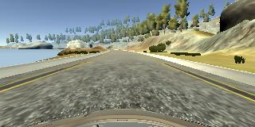

# CarND-Behavioral-Cloning-P3

# **Behavioral Cloning** 

**The goal of this project is to build a convolutional neural network that will predict correct steering angles from images to drive a car around a test track.**

#### The following steps were taken to accomplish this task.
* Used the simulator to collect data of good driving behavior.
* Designed a convolution neural network in Keras that predicts steering angles from images.
* Trained and validated the model with a training and validation set.
* Tested that the model successfully drove around the track without leaving the road.

The python code for accomplishing this project is included in model.py.  A longer version that includes the code to create the figures and other models can be found in the jupyter notebook model_ext.ipyb.  
