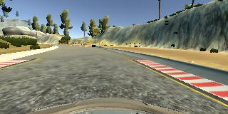
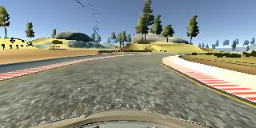
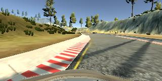
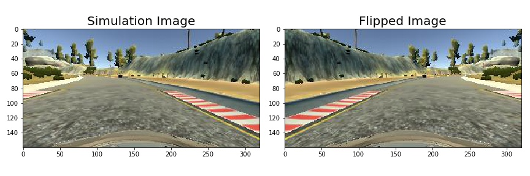
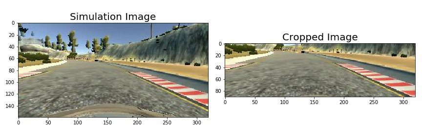

# **Behavioral Cloning** 

**The goal of this project is to build a convolutional neural network that will predict correct steering angles from images to drive a car around a test track.**

#### The following steps were taken to accomplish this task.
* Used the simulator to collect data of good driving behavior.
* Designed a convolution neural network in Keras that predicts steering angles from images.
* Trained and validated the model with a training and validation set.
* Tested that the model successfully drove around the track without leaving the road.

The python code for accomplishing this project is included in model.py.  A longer version that includes the code to create the figures and other models can be found in the jupyter notebook model_ext.ipyb.  

###  Data Collection
A simulator was provided where a car could be driven around two test tracks.  For this project, the simpler test track on the left of the start up page was used.   This simulator has two modes; the  training mode where one can drive and collect data, and the autonomous mode where the car is driven by a model's predictions.

A deep and predictive CNN (convolutional neural network) has a large number of parameters.  A large training set is needed to make a good estimate of the parameters of the model.  The data set was obtained as follows.

##### Data from the Simulator
A total of 9,110 images were collect from the simulator using the following 3 methods.

| Method  | Example Image. |
|:-------:|:--------------:|
| **Driving forward around the track.** The car was driven in the center of the road around the track for 3 laps.||
| **Driving the opposite way around the track.**   The car was driven in the center of the road around the track going in the opposite or clockwise direction for 1 lap. ||
| **Recovering from the left and right sides.**.  The car was driven to the side of the road, and then was recorded recovering from the side back to the center of the road.  This was done all the way around the track for 1 lap. ||

##### Data Augmentation
To increase the amount of data, the images were flipped and the associated steering angle signs were multiplied by -1.  The flipped images and their flipped steering angles were then added to the existing data.  This doubled the number of images making a total of 18,220.  The images were flipped using the opencv function flip() and an example is shown below.

##### Data Preprocessing 
Within a typical image, there is a portion of sky and what looks like a dashboard or hood.  To focus the model on the relevant portion of the road ahead, the images are cropped.  The cropping was performed by Keras, where the top 50 and bottom 20 pixel rows were removed from each image. An example of the cropped image is shown below. 

After each image is cropped, it is normalized by dividing it by 255 and then subtracting by 0.5 ( $image_{normalized} = \frac{image}{255} - 0.5$). 

The data is then randomly shuffled by Keras and divided into training/validation sets using the 80/20 principal.  This allocates 80% or 14,676 images for training and 20% or 3,644 for validation.

###  The CNN design 

1.  **Architecture:**  The CNN model has the following architecture.  It's design was motivated by the paper "End to End Learning for Self-Driving Cars" by Bojarski et al.  The framework is similar to that paper, except that max pooling and dropout layers were added instead of taking strides of 2x2.

| Layer         		|     Description	        					| 
|:---------------------:|:---------------------------------------------:| 
| **Input**         	| 160x320x3 Color Image		  		            | 
| Cropping              | Crop 50 from top, 20 from bottom, outputs 90x320x3 |
| Normalization         | image / 255 - 0.5                             |
| **Convolution 5x5**  	| 1x1 stride, valid padding, outputs 86x316x32 	|
| RELU					| 									        	|
| Max pooling	      	| 2x2 stride,  outputs 43x158x32 				|
| Dropout               | dropout rate = 20%                            | 
| **Convolution 5x5**   | 1x1 stride, valid padding, outputs 39x154x32  | 
| RELU					| 									        	|
| Max pooling	      	| 2x2 stride, outputs 19x17x32 	    			|
| Dropout               | dropout rate = 20%                            | 
| **Convolution 4x4**   | 1x1 stride, valid padding, outputs 16x74x48 	|
| RELU					| 									        	|
| Max pooling	      	| 2x2 stride,  outputs 8x37x48 			     	|
| Dropout               | dropout rate = 20%                            | 
| **Convolution 3x3**   | 1x1 stride, valid padding, outputs 5x35x64 	|
| RELU					| 									        	|
| Dropout               | dropout rate = 20%                            |
| **Convolution 3x3**   | 1x1 stride, valid padding, outputs 4x33x64 	|
| RELU					| 									        	|
| **Fully Connected**	| inputs 8448, ouputs 100 units           	    | 
| RELU                  |                                               | 
| **Fully Connected**   | inputs 100, ouputs 50 units                   |
| RELU                  |                                               | 
| **Fully Connected**   | inputs 50, ouputs 1 units                     |
 

2. **Implementation:** The model was implemented using Keras. The data was randomly shuffled.  Of this data, 80% was used for training and 20% for validation.  This made a total of 14,576 images for training, and 3,644 for validation.  The Adam optimizer was used for optimization and the loss function was 'mse' (mean squared error).  The other hyperparameters were set to epochs=4, batch size=128 and dropout probability rate = 20%.  The number of epochs was set to 4 since the validation loss leveled off and started to increase after 4 epochs.  The dropout rate was set to 20% since the model performed best with that rate.

3. **Approach:** To obtain this model, I first built the least squares fit model, the Lenet-5 model, and the Nvidia model ("End to End Learning for Self-Driving Cars" by Bojarski et al).  The Nvidia model performed the best.  I modified the Nvidia model by adding max pooling and dropout layers instead of taking 2x2 strides.  I also explored using rectangular kernels.  While the original Nvidia model still performed the best, the version above performed reasonably well and is submitted for this project.  

###  Testing
The model was used to successfully drive the car around the test track.  The car was driven for several laps and it maintained a center position even when started from the side of the track. 

### Further Research
* Use the left and right images in the modeling.    
* Explore the performance of other classic CNN models.
* Collect data from the 2nd, more difficult track and create a model that works well on that track.
